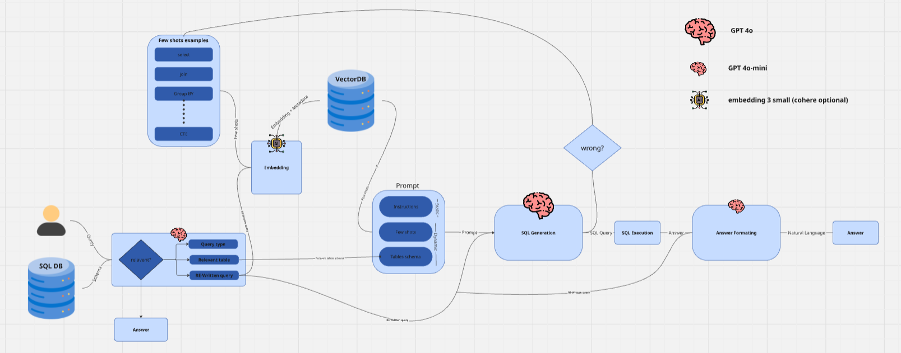

# Text2SQL

Text2SQL is a project that allows users to convert natural language questions into SQL queries, execute them on a database, and return both SQL and natural language answers. The system leverages Azure OpenAI for language processing and Qdrant for vector storage of example pairs.

## Features

- Converts user questions to SQL using Azure OpenAI LLMs.
- Executes generated SQL on a configured SQL database.
- Returns both SQL and natural language answers.
- Stores and retrieves example question-SQL pairs using Qdrant vector store for few-shot learning.
- Supports uploading and managing examples via API.
- Health and status endpoints for monitoring.

## Architecture & Flow



1. **User submits a question** via `/process-query`.
2. **LLM analyzes** the question, rewrites it, and identifies relevant tables.
3. **Similar examples** are retrieved from Qdrant vector store.
4. **Prompt is assembled** with schema, examples, and instructions.
5. **LLM generates SQL** from the prompt.
6. **SQL is executed** on the database.
7. **Results are summarized** into a natural language answer.
8. **Response is returned** with all intermediate data.

## Project Structure

- `backend.py` - Main FastAPI app and API endpoints.
- `backend_logic.py` - Core logic for LLM interaction, prompt assembly, SQL execution, and Qdrant operations.
- `config.py` - All configuration and environment variable loading.
- `schema.py` - Pydantic models for request/response validation.
- `flow.png` - Diagram of the system flow.
- `.env` - Environment variables (not committed).

## Setup

1. **Clone the repository** and install dependencies:
    ```bash
    pip install -r requirements.txt
    ```

2. **Configure environment variables** in a `.env` file:
    ```
    AZURE_OPENAI_ENDPOINT=...
    AZURE_OPENAI_API_KEY=...
    AZURE_OPENAI_API_VERSION=...
    AZURE_OPENAI_EMBEDDING_DEPLOYMENT_NAME=...
    AZURE_OPENAI_CHAT_DEPLOYMENT_NAME=...
    QDRANT_HOST=...
    QDRANT_API_KEY=...
    QDRANT_COLLECTION_NAME=...
    DB_CONNECTION_STRING=...
    ```

3. **Run the API server:**
    ```bash
    python backend.py
    ```

4. **Access API docs:**  
   Visit [http://127.0.0.1:8000/docs](http://127.0.0.1:8000/docs)

## API Endpoints

- `GET /health`  
  Health check and status.

- `POST /process-query`  
  Submit a user question and get SQL + answer.

- `POST /add-examples`  
  Upload a JSON file of examples to the vector store.

- `POST /add-single-example`  
  Add a single example (question/SQL pair).

- `GET /get-all-examples`  
  List all examples in the vector store.

- `DELETE /delete-example/{point_id_str}`  
  Delete an example by ID.

## Example Usage

```bash
curl -X POST "http://127.0.0.1:8000/process-query" \
     -H "Content-Type: application/json" \
     -d '{"user_question": "How many customers are there in France?"}'
```

## Requirements

- Python 3.8+
- FastAPI
- SQLAlchemy
- Azure OpenAI SDK
- Qdrant client
- LangChain
- dotenv

## Notes

- Ensure your Azure OpenAI and Qdrant credentials are correct.
- The database schema and connection string must match your SQL backend.
- For production, secure your API and environment variables.

---
For more details, see the code and API documentation.

